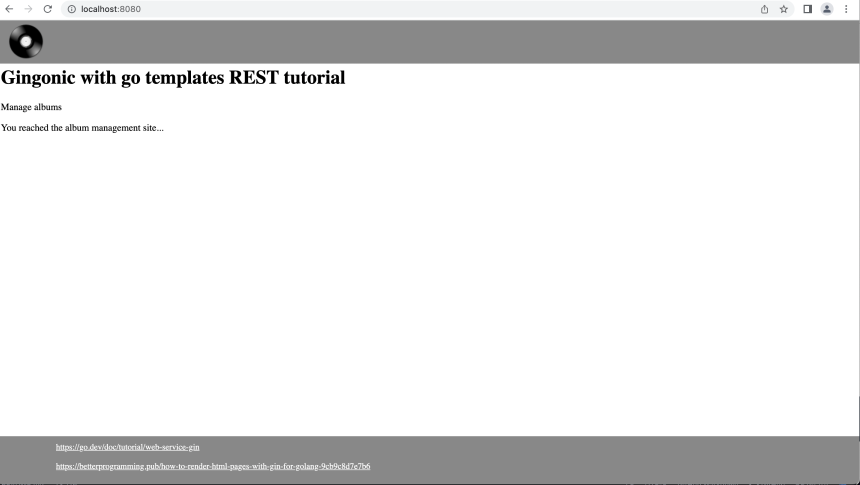
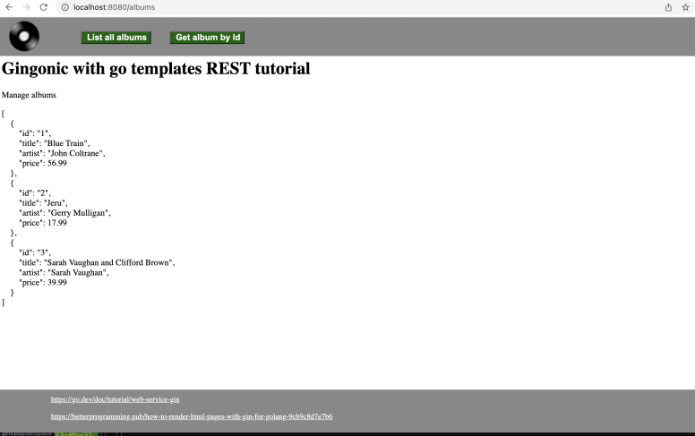
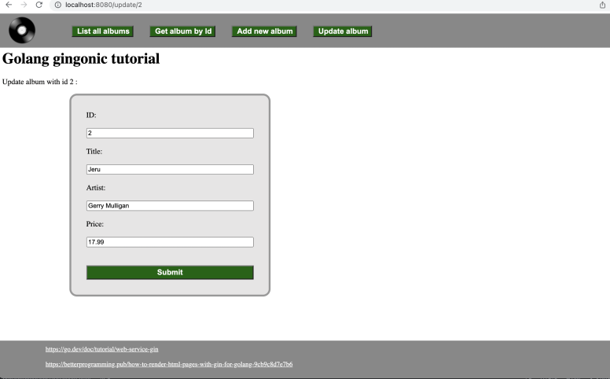

# Gin REST with Go templates, from design to deployment :  a tutorial

## Presentation
- This tutorial is mainly based on the go `web service gin` tutorial: https://go.dev/doc/tutorial/web-service-gin , which presents the basics of processing GET and POST requests using the Gin web framework. This tutorial is referred to as the "original tutorial" in what follows.
- We also used https://betterprogramming.pub/how-to-render-html-pages-with-gin-for-golang-9cb9c8d7e7b6, which shows how to use Gin together with Go templates

All the necessary files (go source, templates, assets) are included in the Github repository

## Step 1 : complete the web-service-gin tutorial
This is what we call the `original tutorial`:
https://go.dev/doc/tutorial/web-service-gin
So just follow it.

At the end of this step, you will have a web-service-gin directory, containing a main.go file, together with go.mod and go.sum.

## Step 2 : read the HTML pages with Gin and templates tutorial
https://betterprogramming.pub/how-to-render-html-pages-with-gin-for-golang-9cb9c8d7e7b6
From this tutorial we borrowed our directory structure: in the original web-service-gin directory, add two directories, templates (containing .html files) and assets (containing various files but notably a menu.js file with some javascript to process menu buttons, and a style.css file for styling).

The main HTML file is index.html, in the 'templates' directory, with the following content:
```
{{template "header.html"}}
<h1 class="title">
	Gingonic with go templates REST tutorial
</h1>
<p id= describe>Manage albums<br />
</p>
<p>{{ .content }}</p>
{{template "footer.html"}}
```

The {{template "header.html"}} line will be substituted by the text in the header.html file. Same for the {{template "footer.html"}} line.

The {{ .content }} part is available for including text sent by the server, as we shall see shortly.
All the rest is plain HTML.

## Step 3 : Hello World with templates
You start this step with the main.go, go.mod and go.sum files resulting from step 1.
You should add a 'templates' directory within your web-service-gin directory, including:
- an 'index.html' file as described above
- a 'header.html' file as follows:
```
{{define "header.html"}}
<!DOCTYPE html>
<html>
<head>
	<meta charset="utf-8">
	<meta name="viewport" content="width=device-width, initial-scale=1">
	<link rel="stylesheet" type="text/css" href="/assets/style.css">
	<link rel="shortcut icon" type="image/png" href="/assets/favicon.png"/>
	<title></title>
</head>
<body>
	<div class ="header">
	<div id="logo"><a href="/"></a></div>
  </div>
  <div class="container">
{{end}}
```
- and a 'footer.html' file as follows:
```
{{define "footer.html"}}
</div> <!-- end container div, see header.html -->
<p style="height:4em;margin:0px;">&nbsp;</p>
<div id="footer">
	<a href="https://go.dev/doc/tutorial/web-service-gin" target="_blank">https://go.dev/doc/tutorial/web-service-gin</a><br /><br />
	<a href="https://betterprogramming.pub/how-to-render-html-pages-with-gin-for-golang-9cb9c8d7e7b6" target="_blank">
		https://betterprogramming.pub/how-to-render-html-pages-with-gin-for-golang-9cb9c8d7e7b6</a>
</div>
</body>
</html>
{{end}}
```
- additionally, you should add, also under the web-service-gin project directory, an 'assets' directory, containing the 'style.css' file, the favicon.png file and the logo.png file. Download them from github.

For our first template application (aka 'hello world') we shall modify main.go as follows:
- after the `router := gin.default()` line, add a  `router.Static("/assets", "./assets")` line, which will allow the program to access the static files required in header.html (style.css, favicon.png, logo.png) from the path 'assets'.
- after that line, add another line with `router.LoadHTMLGlob("templates/*.html")` . When this line gets executed, all .html files in the template directory will be loaded, parsed and ready to be eventually served on your browser
- finally, add the following lines just after the two lines you just added:
```
router.GET("/", func(c *gin.Context) {
	c.HTML(http.StatusOK, "index.html", gin.H{
		"content": "You reached the album management site...",
	})
})
```

This means that when you point your browser to localhost:8080/ (=route "/"), the 'content' field within the index.html template will be filled with "You reached the album management site...".
So try it, by running 'go run .' and pointing your browser to http://localhost:8080 . If all works, you will get the following page in your browser:

![Screenshot after step3 is completed]


## Step 4 : get the /albums and /albums/:id routes working

After you completed Step 3, try pointing your browser to http://localhost:8080/albums

You will get the same result as within the original web-service-gin tutorial:
```
[
        {
                "id": "1",
                "title": "Blue Train",
                "artist": "John Coltrane",
                "price": 56.99
        },
        {
                "id": "2",
                "title": "Jeru",
                "artist": "Gerry Mulligan",
                "price": 17.99
        },
        {
                "id": "3",
                "title": "Sarah Vaughan and Clifford Brown",
                "artist": "Sarah Vaughan",
                "price": 39.99
        }
]
```
But this is not what you want: you want to have the same result printed within your HTML template. For that, you must edit the getAlbums() function, and delete the line `c.IndentedJSON(http.StatusOK, albums)` . We can no longer use the "IndentedJSON" function from the gin package, and we shall have to use the MarshallIndent function from the golang json package. To that effect we include a `prettyPrint(v any) string` function that displays an album or slice of albums as indented json:
```
func prettyPrint(v any) string {
	rep := strings.ReplaceAll
	b,_ := json.MarshalIndent(v, "  ", "\t")
	return rep(rep(string(b), "\n", "<br />"), "\t", "&nbsp;&nbsp;&nbsp;&nbsp;") // no easy function composition in go ...
}
```
After the call to MarshalIndent, we replace all 'return' chars by html `<br />` and all 'tab' chars by html white space.
For this step you should add some imports in the import section:
```
"encoding/json"
"strings"
"html/template"
```
Within 'header.html' add the following lines after the logo div:
```
<div id="menu">
	<button class = "menubouton" onclick='setmenu("/albums")' >List all albums</button>
</div>
```
In the assets directory add a menu.js file:
```
function setmenu(option) {
    // get the origin of the url
    var host = window.location.origin;

    window.location.replace(host + option );
}
```
The 'setmenu' function points your browser to the route you want to contact the server with, in this case the "/albums" route.

Again within header.html add a line to include menu.js as a javascript script:
```
<script type="text/javascript" src="/assets/menu.js"></script>
```


Now rewrite the handler function for the /albums route :
```
func getAlbums(c *gin.Context) {
	c.HTML(http.StatusOK, "index.html", gin.H{
	  "content": prettyPrint(albums),
	})
}
```
Try it with `go run .` : well, still not quite the result we want. Actually all the HTML markup has been escaped by gin.H(). This is due to a safety mechanism to prevent malicious code to be executed. To actually send the unescaped HTML code, you need to transform the getAlbums function as follows:
```
func getAlbums(c *gin.Context) {
	c.HTML(http.StatusOK, "index.html", gin.H{
	  "content": template.HTML(prettyPrint(albums)),
	})
}
```
This time it works as expected.

Now adding the 'view specific album' function is quite straightforward:
- first, add a button in header.html just after the button you just created:
```
<button class = "menubouton" onclick='listalbum()' >Get album by Id</button>
```
- second, in menu.js, add the listalbum() function:
```
function listalbum() {
  var retVal = prompt("Album Id : ", "type Id here");
  if(retVal!="") setmenu("/albums/"+retVal);
}
```
We enter the id of the album with a javascript prompt, which is a quick and dirty solution that should definitely be improved in a production site.
- third and final, rewrite the 'getAlbumByID' handler within main.go, just like we did for the getAlbums handler:
```
func getAlbumByID(c *gin.Context) {
	id := c.Param("id")

	// Loop over the list of albums, looking for
	// an album whose ID value matches the parameter.
	for _, a := range albums {
		if a.ID == id {
			c.HTML(http.StatusOK, "index.html", gin.H{
			  "content": template.HTML("<p>Album with id "+id+" :</p>"+prettyPrint(a)),
			})
			return
		}
	}
	c.HTML(http.StatusOK, "index.html", gin.H{
		"content": "album "+string(id)+" not found",
	})
}
```
Check it again with `go run .` You will get the same result as in the original tutorial, but this time within your template:

![screen after step 4]


## Step 5 : create new album
For this step, we will need 2 more routes:
- one, `GET("/addalbum",...)` to display the input form for the new album
- another one, `POST("/albums",...)`, which was already present in the original (step1) tutorial, to take care of the form data.

### For the `GET("/addalbum",...)` route :
- within main.go, add the route handler:
```
router.GET("/addalbum", func(c *gin.Context) {
	c.HTML(http.StatusOK, "addalbum.html", gin.H{
		"content": "Add new album :",
	})
})
```
Also, within the definition of the album struct, replace all occurrences of `json:...`by `form:...`, since we no longer use json posts but plain HTML forms, as in :
```
type album struct {
	ID     string  `form:"id" binding:"required"`
	Title  string  `form:"title"`
	Artist string  `form:"artist"`
	Price  float64 `form:"price"`
}
```
This is necessary to have the gin function 'Bind' automatically bind the HTML form results with the album struct fields.
`binding:"required"` means that the ID field cannot be a zero value
To know more about binding, read https://gin-gonic.com/docs/examples/binding-and-validation/
- within the templates directory, add the addalbum.html we just referred to in the handler:
```
{{template "header.html"}}
<h1 class="title">
	Golang gingonic tutorial
</h1>
<p>{{ .content }}</p>
</p>
<form action="/albums" method="post">
 <label for="ID">ID:</label> <br /><input type="text" id="ID" name="id" ><br />
 <label for="Title">Title:</label><br /><input type="text" id="Title" name="title" ><br />
 <label for="Artist">Artist:</label><br /><input type="text" id="Artist" name="artist" ><br />
 <label for="Price">Price:</label><br /><input type="text" id="Price" name="price" ><br />
 <input type="submit" value="Submit">
</form>
{{template "footer.html"}}
```
The `<form ... >` line states that the form data will be sent to the POST(/albums) route.

We styled the form (within style.css) on the basis of https://www.digitalocean.com/community/tutorials/how-to-style-common-form-elements-with-css
(still another tutorial ...)
- within header.html, add a button:
```
<button class = "menubouton" onclick='setmenu("/addalbum")' >Add new album</button>
```
### For the `POST("/albums",...)` route :

Modifiy the original `POST("/albums",...)` handler as follows:
```
func postAlbum(c *gin.Context) {
    var newAlbum album
    log.Println("Prix="+c.PostForm("price"))
    // Call Bind to bind the received form to
    // newAlbum and report possible errors
    if err := c.Bind(&newAlbum); err != nil {
			  c.HTML(http.StatusOK, "index.html", gin.H{
			    "content": template.HTML("Error "+err.Error()),
			  })
			  return
    }

    // Add the new album to the slice.
    albums = append(albums, newAlbum)

    c.HTML(http.StatusOK, "index.html", gin.H{
        "content": template.HTML("<p>New album :</p>"+prettyPrint(newAlbum)),
    })
}
```
We Use GinGonic `Bind` function to bind the data in the form to newAlbum (passed by reference)
All validation and conversion (eg converting price from string to float64) will be carried out and errors (eg conversion errors) will be reported

## Step 6 : update album
This step (the 'U' in CRUD) is not covered in the original tutorial. It will allow us to modify any album in the collection provided we know its ID. (We shall not cover the 'D' in CRUD, the delete function; this is left as a further exercise).

Normally, updates should be performed using the PUT method. However, gin does not provide a specific API for PUT, so we use the POST method.

Again we shall need two routes:
- one, the `GET("/update/:id",...)` route, to display the input form pre-filled with data from the album to be modified
- another one, `POST("/albums/:id",...)`, to process the form data and perform the actual update

### For the `GET("/update/:id",...)` route :
We shall use addalbum.html as in Step 5, but we shall modify it in order to pre-fill the input values, using the go template syntax:
```
{{template "header.html"}}
<h1 class="title">
	Golang gingonic tutorial
</h1>
<p>{{ .content }}</p>
</p>
<form action="{{ .action }}" method="post">
 <label for="ID">ID:</label> <br /><input type="text" id="ID" name="id" value="{{ .id }}" ><br />
 <label for="Title">Title:</label><br /><input type="text" id="Title" name="title" value="{{ .title }}" ><br />
 <label for="Artist">Artist:</label><br /><input type="text" id="Artist" name="artist" value="{{ .artist }}" ><br />
 <label for="Price">Price:</label><br /><input type="text" id="Price" name="price" value="{{ .price }}" ><br />
 <input type="submit" value="Submit">
</form>
{{template "footer.html"}}
```
You will notice that we added 5 modifiable areas: {{ .action }}, {{ .id }}, {{ .title }}, {{ .artist }} and { .price }}.
The .action area is needed if we want to use the same form both for creating an album and udpating one.
For this to work we shall first need to modify the GET("/addalbum"...) handler from the previous step. This now becomes:
```
router.GET("/addalbum", func(c *gin.Context) {
	c.HTML(http.StatusOK, "addalbum.html", gin.H{
		"content": "Add new album :",
		"action": "/albums",
	})
})
```
We now add a `GET("/update/:id"` route to the router:
```
router.GET("/update/:id", updateAlbum)
```
and the handler, namely the updateAlbum function:
```
func updateAlbum(c *gin.Context) {
	id := c.Param("id")
	// Loop over the list of albums, looking for
	// an album whose ID value matches the parameter.
	for _, a := range albums {
		if a.ID == id {
			c.HTML(http.StatusOK, "addalbum.html", gin.H{
			  "content": template.HTML("<p>Update album with id "+id+" :</p>"),
				"action": "/albums/"+id,
				"id" : a.ID,
				"title" : a.Title,
				"artist" : a.Artist,
				"price" : fmt.Sprintf("%.2f", a.Price),
			})
			return
		}
	}
	c.HTML(http.StatusOK, "index.html", gin.H{
		"content": "album "+string(id)+" not found",
	})
}
```
Please notice that we now have 6 arguments in the gin.H function (by the way, this is the reason for the dangling comma in the last item you may have noticed in all calls to gin.H()).

Now perform some updates:
* in header.html add the update button:
```
<button class = "menubouton" onclick='updatealbum()' >Update album</button>
```
* include the updatealbum function in menu.js:
```
function updatealbum() {
  var retVal = prompt("Id of album to update :", "type Id here");
  if(retVal!="") setmenu("/update/"+retVal);
}
```
* in the import section of main.go, add "fmt"

### For the `POST("/albums/:id",...)` route :
Add this route to the router:
```
router.POST("/albums/:id", putAlbum)
```
Add a handler for this route, namely the putAlbum function:
```
func putAlbum(c *gin.Context) { // Using method POST, no good support for PUT in Gin
	id := c.Param("id")
	// Loop over the list of albums, looking for
	// an album whose ID value matches the parameter.
	for i, a := range albums {
		if a.ID == id {
			// Use GinGonic `Bind` function to bind the data in the form to albums[i]
			// All validation and conversion (eg converting price from string to float64)
			// will be carried out and errors (eg conversion errors) will be reported
			if err := c.Bind(&albums[i]); err != nil {
				c.HTML(http.StatusOK, "index.html", gin.H{
				  "content": template.HTML("Error "+err.Error()),
				})
				return
	    }
			albums[i].ID = id // should not change id !!
			c.HTML(http.StatusOK, "index.html", gin.H{
			  "content": template.HTML("<p>Updated album with id "+id+" :</p>"+prettyPrint(albums[i])),
			})
			return
		}
	}
	c.HTML(http.StatusOK, "index.html", gin.H{
		"content": "album "+string(id)+" not found",
	})
}
```
Nothing really new here. So just try it with `go run .`. If you try to update the album with id 2, you will get the following screen:

![Update screen at the end of step 6]


## Step 7 : containerization

We shall build a Docker image using a Dockerfile.
First, within the web-service-gin project directory, create a .dockerignore file. This file, with a syntax similar to .gitignore, will specify files not to be included in the Docker image. For us this might be :
```
.dockerignore
.gitignore
private
tuto
README.md
```
Then create a file named Dockerfile in the same directory:
```
# syntax=docker/dockerfile:1
##
## Build the application from source
##
# https://docs.docker.com/language/golang/build-images/

FROM golang:1.19 AS build-stage

WORKDIR /app

COPY . .
RUN go mod download

RUN CGO_ENABLED=0 GOOS=linux go build -o /gin-html-templates

##
## Deploy the application binary into a lean image
##

FROM scratch AS build-release-stage

WORKDIR /

COPY --from=build-stage /gin-html-templates /gin-html-templates
COPY ./templates ./templates
COPY ./assets ./assets
EXPOSE 8080

ENTRYPOINT ["/gin-html-templates"]
```
All lines beginning with # are comment lines.

This is a 2 stage Dockerfile, each stage being marked by a FROM command.

The first stage, named build-stage, is based on the golang:1.19 Docker image, which includes all that is needed for golang compilation. The WORKDIR command creates an app directory (within the image's file system, not within your file system !) and sets it as working directory (to which files will be copied by the COPY command).

The `COPY . .` command copies all files and directories in the project directory (except those specified in .dockerignore) to the app directory in the image.

The `RUN go mod download` command will carry out 'go mod download' , after which all modules specified in the go.mod file will be downloaded (to the image !!), so we next can compile main.go with the `RUN CGO_ENABLED=0 GOOS=linux go build -o /gin-html-templates` which will built a binary file (-o) named `gin-html-templates`.

The second stage starts with `FROM scratch AS build-release-stage` : the `scratch` image is a minimal image just allowing you to run your go binary, meaning that the final image will weigh about 14 MB. The WORKDIR in this stage is the root of the build-release-stage image.

We then COPY the /gin-html-templates obtained at the end of the build-stage to the final image.
We also COPY the templates and the assets directories in your local project directory to templates and assets directories in the image: these directories are required for the execution of your go program, and they will be loaded by the program on startup.

The `EXPOSE 8080` line means that port 8080 will be available from the image.

And finally the `ENTRYPOINT ["/gin-html-templates"]` command will mean that, when you run the image, your `gin-html-templates` program will be launched.

Now `build` your image with `docker build -t ghtemp .` , to be launched within your web-service-gin directory: this command asks Docker to build an image based on the Dockerfile in the present directory (hence the `.` at the end of the line). This will take some time when you do it for the first time. The image will be tagged as 'ghtemp'. Check that it has been created with `docker ps -a`.

If all went well, you can now run your image : `docker run --publish 8080:8080 ghtemp`. The --publish argument (which can be shortened to -p) means that the 8080 port in the image will be fitted with the 8080 port in your system. From your browser you may check that you get now the same screens from localhost:8080, but the time the server is within the Docker image.

## Step 8 : deploy to fly.io

fly.io (https://fly.io/) is interesting for hobby development since it offers a 'hobby' free plan which allows for up to 3 shared-cpu-1x 256mb  ,3GB persistent volume storage (total) and 160GB outbound data transfer (as of July 2023).

Sign up for an account at https://fly.io/app/sign-up if you don't already have one. You will have to give a credit card number which will be billed only if you exceed the 'free' allowances.

You will then need to install the flyctl command line tool. On a mac this is as easy as `brew install flyctl` .

Since you have a Dockerfile, deploying to fly.io will be a breeze: once flyctl is installed, just type, from within your project directory, `fly launch` . You will be asked a few questions, such as:
```
? Choose an app name (leave blank to generate one): ginhtmltemp (you may want to change the name ...)

automatically selected personal organization: xxxx yyyy
Some regions require a paid plan (bom, fra, maa).
See https://fly.io/plans to set up a plan.

? Choose a region for deployment: Paris, France (cdg)
App will use 'cdg' region as primary

Created app 'ginhtmltemp' in organization 'personal'
Admin URL: https://fly.io/apps/ginhtmltemp
Hostname: ginhtmltemp.fly.dev
? Would you like to set up a Postgresql database now? No
? Would you like to set up an Upstash Redis database now? No
Wrote config file fly.toml
? Would you like to deploy now? Yes
```
The docker image is built locally, after which it is pushed to fly.io. Finally you get the message:
`Visit your newly deployed app at `https://ginhtmltemp.fly.dev/.
So just go visit it.

Now for a little experiment: add an album (as you did in the local version of the app), then list all albums: good, the new album is listed along with the others. Now close your computer, read a good book, have a nap, and come back to your app. List all albums again: surprise, surprise, the album you previously added has disappeared.

What happened ? After 6 - 7 minutes inactivity, your app was stopped. It gets started again when you send a new request from your browser, with all initial values, notably the 'albums' slice: your changes got lost. In order to save permanent changes in data, you will need a persistency solution: either a database, or a Volume... More tutorials to come ...
